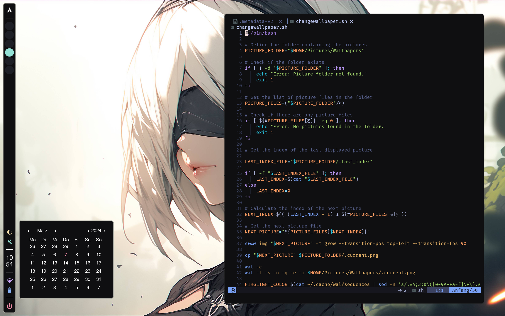

  

###

###

<h1 align="center">Hyprland/Arch Dotfiles</h1>

###

<h3 align="left">🛠  Attantion</h3>

###

This Rice is intended for personal use. It is currently at a very early stage of development. So use it at your own risk.

###

<h2 align="left">Needed Software</h2>

###

- Hyprland  > v0.36 - Rofi (wayland fork) - Hyprlock - Hypridle - Elkowears weacky widgets - Swww - Kitty - SDDM - Firefox - Kvantum - qt6ct/qt5ct - Network Manager - Blueman - swaync

###

<h2 align="left">Needed small cattle :3</h2>

###

- FiraCode Nerd Font - Better Discord - Amixer - Brightnessctl - bc - ZSH Shell - Oh My ZSH Plugin

###

<h2 align="left">Installation</h2>

###

Working on Automated installation... Currently you can just copy the folders :)   The Wallpaper folder in your 'Pictures' Folder.  The contents of .config/sddm folder 
in the /usr/share/sddm/themes folder. And edit the /etc/sddm.conf file to include:  
[Theme] 
Current=sugar-candy

  And put the Rest of the .config folder in your own .config folder.

###

<h2 align="left">Config Files</h2>

###

The dotfiles are a mess :D. The code makes no sense and is poorly documented.  Also everything is solved in a rather cumbersome way so expect some things to change at some point.  Don't expect too much, I don't have much time. Ah and some things don't work.

## Showcase Section
-
	
     	
    	

###

<h3>FAQ</h3>

F: Why is it called Aurora

A: Starfield drug (don't ask)

